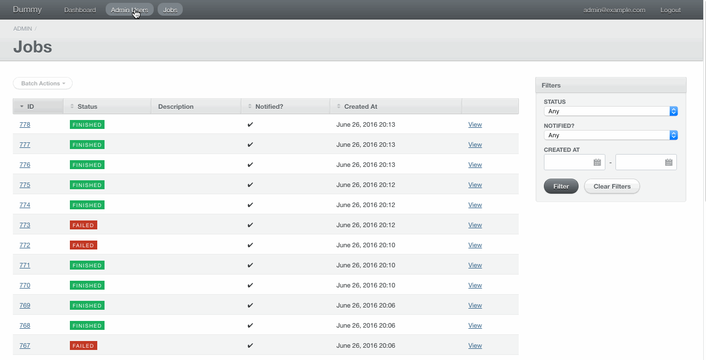
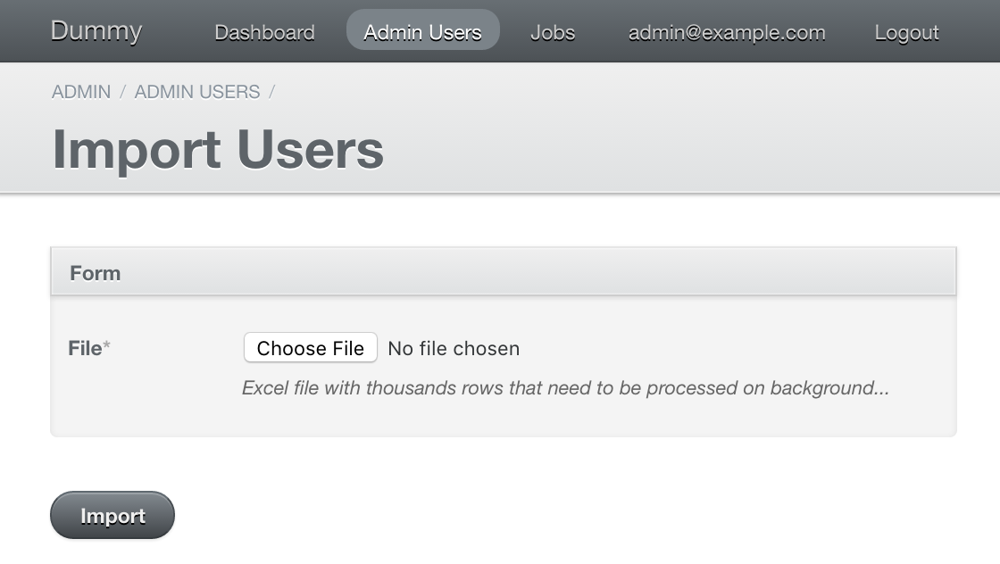
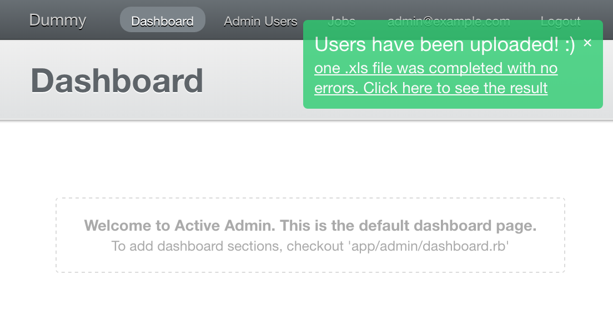
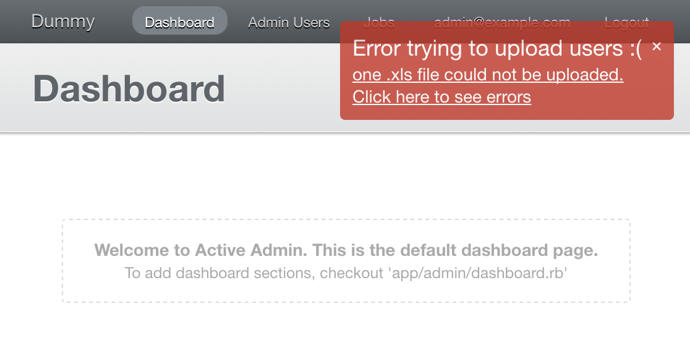
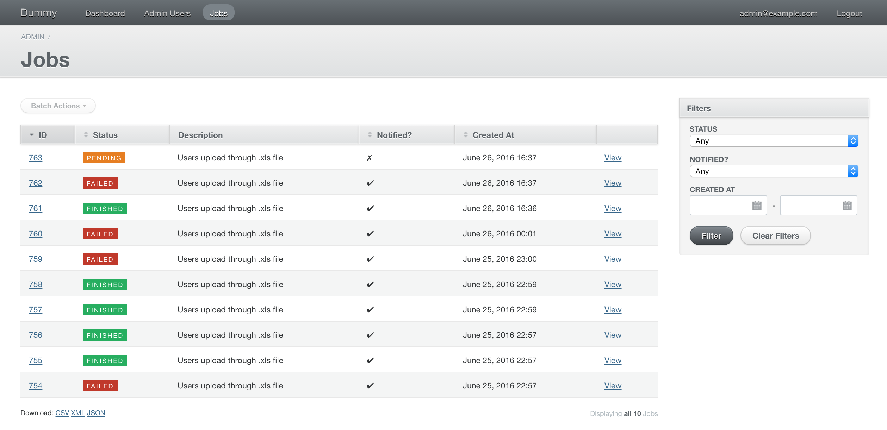
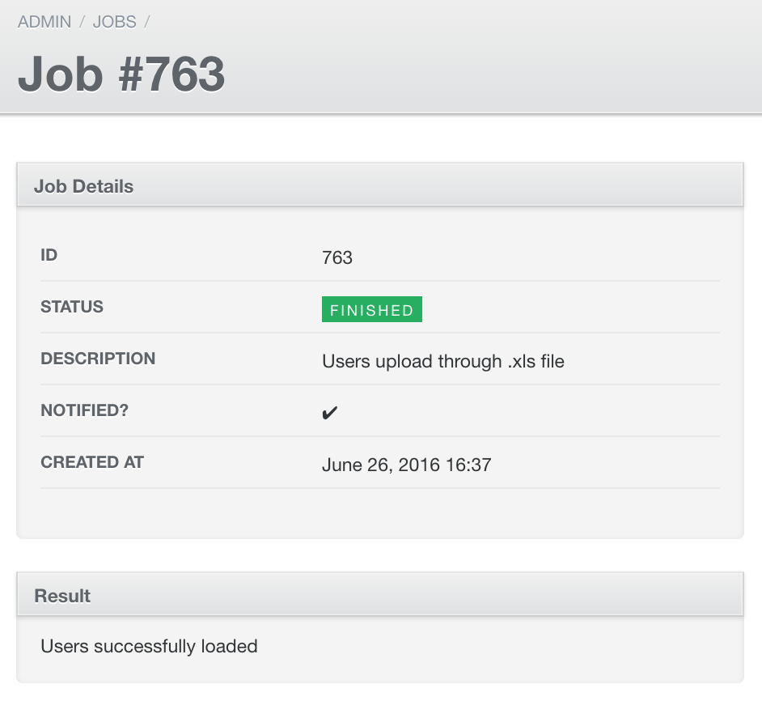
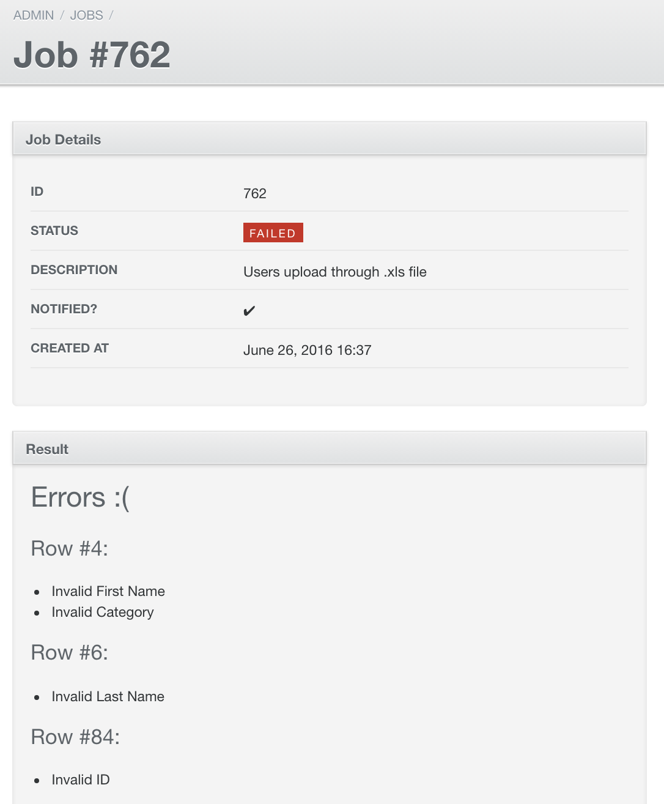

# Active Admin Jobs

It's a Rails engine that allows you to play nice with [Active Job](https://github.com/rails/activejob) in [Active Admin](https://github.com/activeadmin/activeadmin) providing user feedback.

- An Active Admin's index view to list jobs.
- An Active Admin's show view to see job details with a special panel to show success/error feedback. To achieve this we are going to use the [Job Notifier](https://github.com/platanus/job_notifier) gem.
- A way to customize the success and error partials.
- A mechanism to listen job status changes and notify them using [jQuery Growl](http://ksylvest.github.io/jquery-growl/)

## Installation

Add to your Gemfile:

```ruby
gem "activeadmin_jobs"
```

```bash
bundle install
```

```bash
rails generate job_notifier:install
```

If you use `AdminUser` class in `ActiveAdmin` you will need to add the following code:

```ruby
class AdminUser < ActiveRecord::Base
  include JobNotifier::Identifier
  identify_job_through(:id, :email)

  # more code...
end

```

## Usage

To make it easy I'm going to explain how to use this gem with an example.

Example:

As an **admin user**:

1. From a form, I want to pick a big .xls file containing users information.
2. In the endpoint pointed by the form, I want to create a job to parse that heavy file in background to create users in the system.
3. I need a way to know when the process is completed.
4. Also, I want to see success and error feedback.



Next, I will explain how to solve each step:

#### Step 1: pick the file.

Suppose you want to go to the import form from the `AdminUser`'s index page. To do that, you can add an `action_item` with a `collection_action`:

*/your_app/app/admin/admin_users.rb*

```ruby
ActiveAdmin.register AdminUser do
  # more code...
  action_item :import_users, only: :index do
    link_to "Import Users", import_form_admin_admin_users_path
  end

  collection_action :import_form, title: "Import Users" do
    # Nothing here. We just want to render the form.
  end
end
```

With the related wiew:

*your_app/app/views/admin/admin_users/import_form.html.erb*

```erb
<%= semantic_form_for :data, url: { action: :import }, method: :post do |f| %>
  <%= f.inputs "Form" do %>
    <%= f.input :source, as: :file, label: "File", :hint => "Excel file with thousands rows that need to be processed in background..." %>
  <% end %>
  <%= f.actions do %>
    <%= f.action :submit, as: :button, label: "Import" %>
  <% end %>
<% end %>
```



You need to add the endpoint pointed in the form action too.

*/your_app/app/admin/admin_users.rb*

```ruby
ActiveAdmin.register AdminUser do
  # more code...
  collection_action :import, title: "Import Users", method: :post do
    # We fill this in the next step.
  end
end
```

#### Step 2: create a job.

Inside the import action definition, you need to call the job in charge of parsing the .xls file. To do this:

First, we need to create the job. We need to do it using `perform_with_feedback` method provided by [Job Notifier](https://github.com/platanus/job_notifier) gem. You can see how it works reading the **Third and Fourth Steps** of the [usage section](https://github.com/platanus/job_notifier#usage).

*/your_app/app/jobs/user_upload_job.rb*

```ruby
class UserUploadJob < ActiveJob::Base
  def perform_with_feedback(xls_path)
    # Here you need to process the file an return a success or error result.
    #
    # Lets say I'm going to return this message:
    #
    # "Users successfully loaded"
    #
    # with a successful result and something like this:
    #
    # errors = [
    #   { row: 4, errors: ["Invalid First Name", "Invalid Category"] },
    #   { row: 6, errors: ["Invalid Last Name"] },
    #   { row: 84, errors: ["Invalid ID"] }
    # ]
    #
    # raise JobNotifier::Error::Validation.new(errors)
    #
    # with unsuccessful result.
  end
end

```

Then, we call the job in the import action:

*/your_app/app/admin/admin_users.rb*

```ruby
ActiveAdmin.register AdminUser do
  # more code...
  collection_action :import, title: "Import Users", method: :post do
    file_path = get_file_path(params[:data][:source]) # I'm not going to implement this. It's just an example.
    UserUploadJob.perform_later(current_admin_user.job_identifier, file_path)
  end
end
```

#### Step 3: notify process completion.

You don't need to do nothing here, the gem will do it for you using [jQuery Growl](http://ksylvest.github.io/jquery-growl/).

On success...



On error...



#### Step 4: show success and error feedback.

The gem includes an index view for jobs. There, you can see a jobs list with the current state of each job.



To show feedback, you need to add one partial by possible job state prefixed by the job's class name in snake_case. For example:
If you have the `UserUploadJob` job, following the convention: `_[job_class_name].[job_state].html.erb`, you will need two partials:

One for success...

*/your_app/app/views/admin/jobs/_user_upload_job.finished.html.erb*

```erb
<%= result %>
```

> Remember: we get this: "Users successfully loaded" as `result` on success.



One for error...

*/your_app/app/views/admin/jobs/_user_upload_job.failed.html.erb*

```erb
<h2>Errors :(</h2>

<% result.each do |record| %>
  <h3>Row #<%= record[:row] %>:</h3>
  <ul>
    <% record[:errors].each do |error| %>
      <li><%= error %></li>
    <% end %>
  </ul>
<% end %>
```

> Remember: we get something like this:
```ruby
[
  { row: 4, errors: ["Invalid First Name", "Invalid Category"] },
  { row: 6, errors: ["Invalid Last Name"] },
  { row: 84, errors: ["Invalid ID"] }
]
```
as `result` on error.



Those partials will be rendered in the job's show view depending on its state.

## I18n

If you want to translate your notifications, you can do it following this convention:

**/your_app/config/locales/en.yml**

```yml
en:
  activeadmin_jobs:
    [job_class_name]:
      description: "XXX"
      finished:
        title: "XXX"
        one: "XXX"
        other: "XXX"
      failed:
        title: "XXX"
        one: "XXX"
        other: "XXX"
```

For example:

```yml
en:
  activeadmin_jobs:
    user_upload_job:
      description: "Users upload through .xls file"
      finished:
        title: "Users have been uploaded! :)"
        one: "One .xls file was completed with no errors. Click here to see the result"
        other: ".xls files were completed with no errors. Click here to see the result"
      failed:
        title: "Error trying to upload users :("
        one: "One .xls file could not be uploaded. Click here to see errors"
        other: ".xls files could not be uploaded. Click here to see errors"
```


## Contributing

1. Fork it
2. Create your feature branch (`git checkout -b my-new-feature`)
3. Commit your changes (`git commit -am 'Add some feature'`)
4. Push to the branch (`git push origin my-new-feature`)
5. Create new Pull Request

## Credits

Thank you [contributors](https://github.com/platanus/activeadmin_jobs/graphs/contributors)!


Active Admin Jobs is maintained by [platanus](http://platan.us).

## License

Active Admin Jobs is © 2016 platanus, spa. It is free software and may be redistributed under the terms specified in the LICENSE file.
